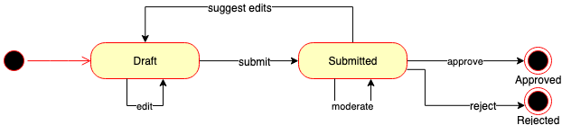

# Lifelines webshop

## Install

```bash
cp .lifelinesrc.example .lifelinesrc
yarn install
yarn run serve
```

- **i18n**
  For development and testing you can add your translations to `i18n.schemas.js`
  For production make sure to add the translations to the molgenis entity `Localization` using `lifelines-webshop` as a namespace.

  >tip:
  Use `i18n.schemas.js` to create the `Localization` entities. For `msgid` add the schema key (for example: "lifelines-webshop-sidebar-header")
  The namespace should be `lifelines-webshop` and than add all of the needed translations.

## Common commands

```bash
yarn build     # Compile and minify
yarn test      # Run your tests
yarn lint      # Lints and fixes files
yarn test:e2e  # Run your end-to-end tests
yarn test:unit # Run your unit tests
```

## Deployment (Kubernetes)

  > Ask Ops for help to setup kubectl and Rancher if you don't have them setup yet.

- Deploy the `lifelines-webshop` Helm chart on [Rancher](https://rancher.molgenis.org:7777/p/c-rrz2w:p-dtpjq/apps/catalog/cattle-global-data:molgenis-helm-lifelines-webshop). Write down the generated Molgenis token in the `TRANSFORM` section.

- Install [Molgenis commander](https://github.com/molgenis/molgenis-tools-commander)
- Add `deployment/datasets` directory to the `dataset_folders` section of `~/.mcmd/mcmc.yaml`
- Add `deployment/resources` folder to the `resource_folders` section of `~/.mcmd/mcmc.yaml`
- Configure Molgenis commander to run on the lifelines server

  ```bash
  mcmd config add host
  mcmd config set host
  ```

- Set the ll_admin password in the lifelines script

  ```bash
  cp ./deployment/lifelines ~/.mcmd/scripts/
  vim ~/.mcmd/scripts/lifelines
  add user ll_admin --set-password *******
  ```

- Proxy the Molgenis instance and follow the commander script to setup the server:

  ```bash
  kubectl port-forward svc/molgenis 8080:8080 --namespace lifelines-catalog-test
  mcmd run lifelines -i
  ```

- Login as admin to Molgenis and add the `TRANSFORM` Molgenis token you generated
  earlier the Helm chart.

- Go to the [Transform pod](https://rancher.molgenis.org:7777/p/c-rrz2w:p-dtpjq/workload/cronjob:lifelines-catalog-test:transform) on Rancher and test the Transform with:

```bash
kubectl create job manual-transform --from cronjob/transform --namespace lifelines-catalog-test
```

## Dataflows


To transform the raw data to a format that can be used by this app, use the
[molgenis-py-lifelines-transform](https://github.com/molgenis/molgenis-py-lifelines-transform) tool.

### Workflow of the catalog


### Order process



## Production settings

A couple of things have to be configured in order to run this app in production:

- **vue.config.js**
  Add a public path to specify the path on which the app is served.

  ```bash
  const packageJson = require('./package.json')

  ...
  module.export
    ...
    publicPath: process.env.NODE_ENV === 'production'
      ? packageJson.name + '/dist/'
      : '/',
  ```

- **package.json**
  Add a scope for the package name to publish to a organisation scope on NPM.

  ```bash
  "name": "*scope*/molgenis-app-lifelines-webshop",
  ```

  Add the publish config with scope public, otherwise you cannot publish to NPM.

  ```bash
  "publishConfig": {
    "access": "public"
  },
  ```

  Add a target for webservers to resolve to.

  ```bash
  "main": "dist/index.html",
  ```

  Add directories to pick up when building for production.

  ```bash
  "files": [
    "dist",
    "src"
  ],
  ```

- **route.ts**
  Change the default base when you want to serve your app on a path other than ```/```

  ```bash
  export default new Router({
  ...
  base: process.env.NODE_ENV === 'production' ? packageJson.name : process.env.BASE_URL,
  ```
